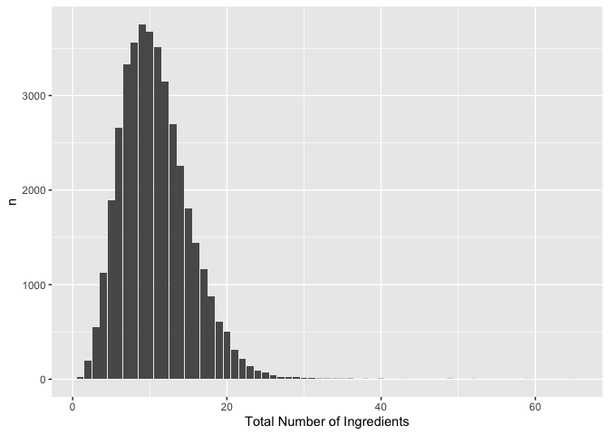
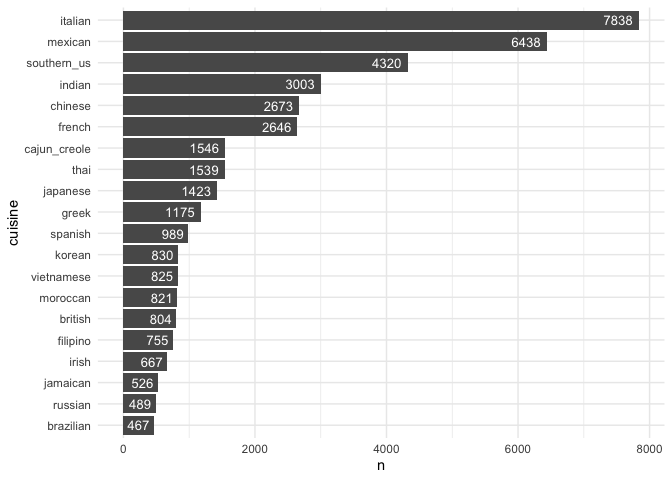
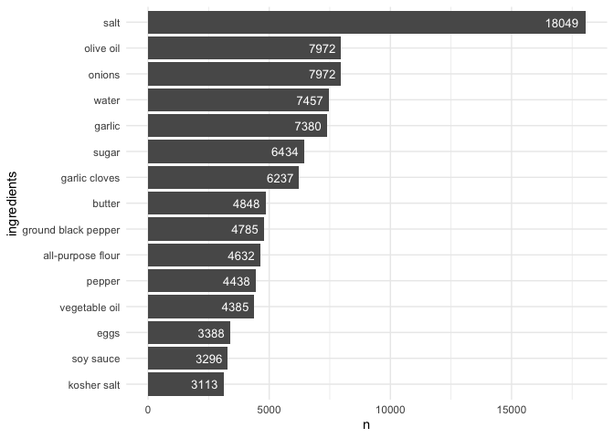
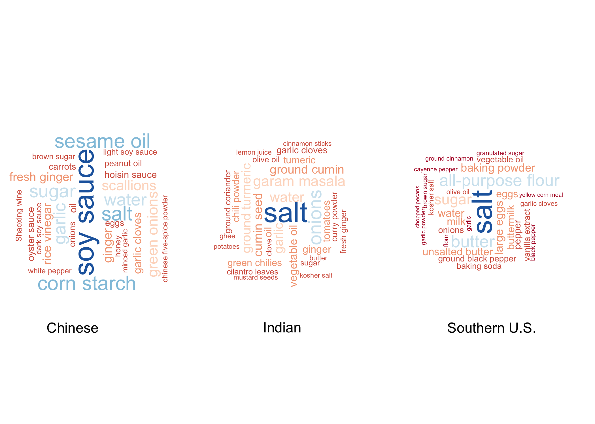
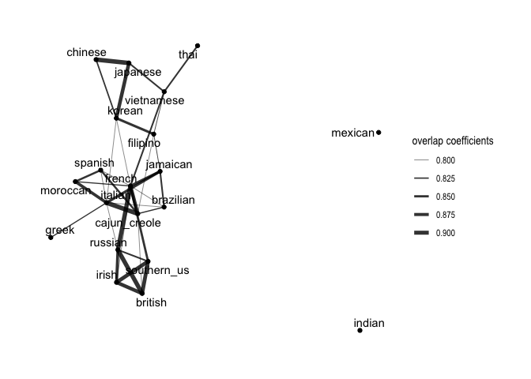

Load data
---------

number of ingredients distribution
----------------------------------

average number of ingredients for each cuisine type
---------------------------------------------------

cuisine distribution
--------------------

most common ingredients
-----------------------

difference between each cuisine
-------------------------------

undirected graph
----------------

